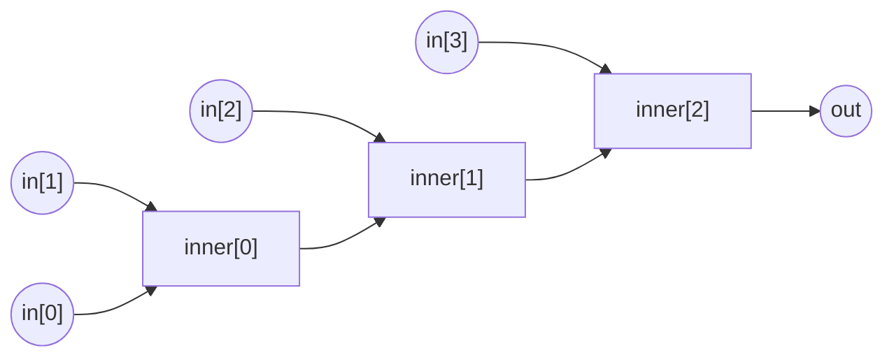

# `Multiplier`

```cs
template Multiplier(n) {
  assert(n > 1);
  signal input in[n];
  signal output out;

  signal inner[n-1];
  inner[0] <== in[0] * in[1];
  for(var i = 0; i < n - 2; i++) {
    inner[i+1] <== inner[i] * in[i+2];
  }

  out <== inner[n-2];
}
```

There may be several "Hello World!"s of Circom, and I believe Multiplier circuit is one of them. All that we are doing here is computing the product of all elements in an array.

Since multiplying more than two signals at once is non-quadratic, we have to do this two at-a-time. Here is how multiplying 4 numbers looks like:



There is really not much more to talk about in this circuit. It is simply a great way to test out whether you can understand the Circom syntax, loops, template parameters and such.

> If you really like having everything as "gates" you could write the circuit with a Multiplier gate:
>
> ```cs
> template Mul() {
>   signal input in[2];
>   signal output out;
>
>   out <== in[0] * in[1];
> }
> ```
>
> Then, within the `Multiplier` you can use the `Mul` gate for each multiplication.

## Soundness

Imagine that you would like to use the circuit above to prove that you know some factors $q_1, q_2, \ldots, q_n$ for some number:

$$
k = \prod_{i=1}^{n}q_i
$$

Would it be okay to use the circuit above as given, with `out` as the only public signal?

If you think about this for a while, you will realize that the circuit does not care if a factor is 1 or not! Meaning that one can provide the same proof just by providing an array `[k, 1, ..., 1]` since:

$$
k = \prod_{i=1}^{n}q_i = k \times \prod_{i=2}^{n}1
$$

Even further, if $n$ is even one can do:

$$
k = k \times \prod_{i=2}^{n/2} r_i \times r_i^{-1}
$$

These are classified as soundness errors, as they allow creating of valid proofs without actually proving the intended statement.

> The circuit author is responsible from checking these edge-cases, and writing the necessary constrains to prevent soundness errors.
