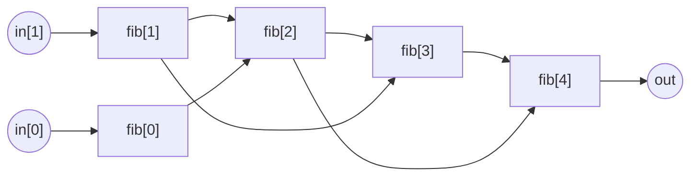

# `Fibonacci`

```cs
template Fibonacci(n) {
  assert(n >= 2);
  signal input in[2];
  signal output out;

  signal fib[n+1];
  fib[0] <== in[0];
  fib[1] <== in[1];
  for (var i = 2; i <= n; i++) {
    fib[i] <== fib[i-2] + fib[i-1];
  }

  out <== fib[n];
}
```

Calculating `n`'th Fibonacci number is yet another "Hello World!" of Circom. We simply constrain the starting numbers (given as input `in`) and assert the recurrence relation

$$
a_n = a_{n-1} + a_{n-2}
$$

Here is how computing the 4'th Fibonacci number looks like:



> You can also implement Fibonacci recursively in Circom!
>
> ```cs
> template FibonacciRecursive(n) {
>   signal input in[2];
>   signal output out;
>
>   if (n <= 1) {
>     out <== in[n];
>   } else {
>     var prev = FibonacciRecursive(n-1)(in);
>     var prevprev = FibonacciRecursive(n-2)(in);
>     out <== prev + prevprev;
>   }
> }
> ```
>
> However, the constraint count will be much higher, because this is the "stupid" recursive way where we are not memoizing. In fact, the constraint counts themselves will be a Fibonacci number in this circuit.
