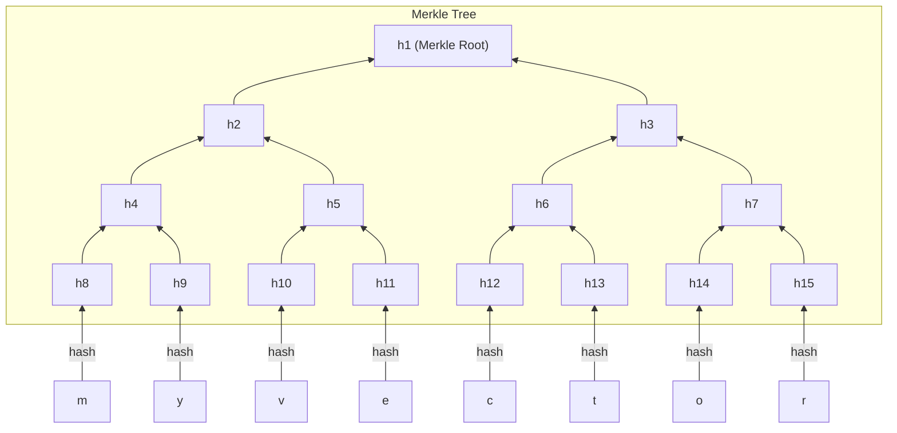
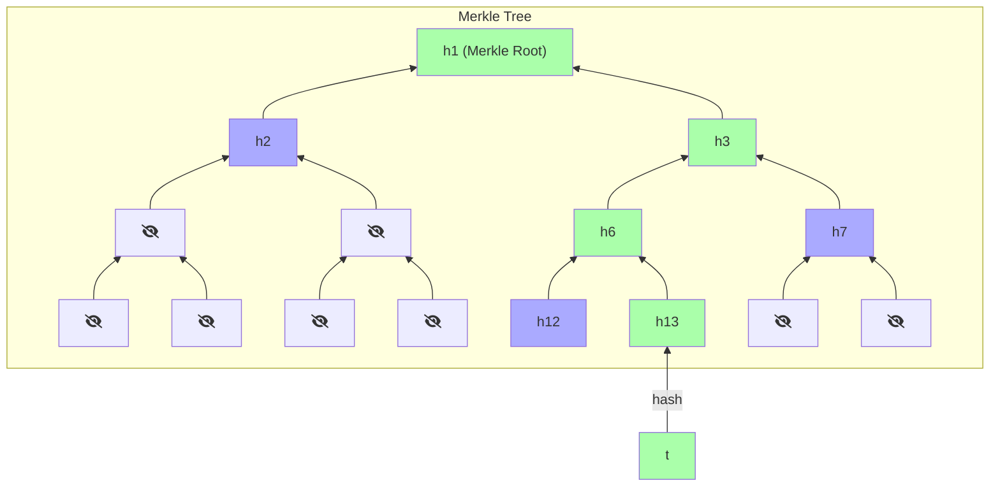

# Merkle Trees

If you have been in the world of crypto for a while, it is highly likely that you have heard the term [Merkle Tree](https://brilliant.org/wiki/merkle-tree/), also known as Merkle Hash Tree. A Merkle Tree is a hash-based data structure, an can serve as a cryptographic commitment scheme.

You can commit to a set of values using a merkle tree, such as:

- Evaluations of a function
- Coefficients of a polynomial
- Files in your database

Here is an example, where we commit to a vector $\vec{v} = [m, y, v, e, c, t, o, r]$ using a Merkle Tree:

In a Merkle Tree, every node is made up of the hash of its children. In this example binary tree, that would be:

- $h_1 = H(h_2, h_3)$
- $h_2 = H(h_4, h_5)$
- $h_3 = H(h_6, h_7)$
- and so on.

The leaf nodes are the hashes of elements of the committed set of data. The final hash $h1$ at the root of the tree is called the **Merkle Root**.

> Merkle Trees are often implemented as binary trees, but the concept works for $n$-ary trees as well, where each node has $n$ children.

## Merkle Proof

At some point, we may be asked to show that indeed some element of the comitted data exists at some position. For our example above, a verifier could ask "is there really a $t$ at position 6?".

A naive method here would be give the entire comitted set of data, and let them prove the Merkle Root; however, we can do much better than that! With Merkle Trees, we can answer such queries in a much more efficient way, and without revealing any other data than the one we are asked to reveal.

The trick is to provide the hashes needed to compute all the way from the requested element up to the Merkle Root. In total, we only need to provide one hash per level (in the case of a binary-tree Merkle Tree) and the verifier can compute the root!

For instance, to show that we have $t$ at position 6, we need to provide the hashes that are used to compute the parent nodes.

- $h_{13} = H(t)$ is computed by verifier.
- $h_6 = H(h_{12}, h_{13})$ requires $h_{12}$ to be provided.
- $h_3 = H(h_6, h_7)$ requires $h_7$ to be provided.
- $h_1 = H(h_2, h_3)$ requires $h_2$ to be provided.
- $h_1$ is our commitment, which the verifier knows already.

The proof is visualized below for the same tree, where the values known & computed by the verifier are colored green and the values provided by the prover are colored blue:

You see, we only needed to provide 3 hashes here, although our data had 8 elements! In fact, if you have $n$ elements you only need to provide $\log_2{n}$ elements to the verifier, this is so much more efficient than the naive method of sending all the data to the verifier.

- The root is the **commitment** to the vector.
- The **reveal** a value in the commitment (which is a leaf in the tree) prover does the following:
  - Send sibling hashes of all nodes on root-to-leaf path.
  - Verifier checks if the hashes are consistent with the root hash.
  - The size of this proof to reveal a value is $\mathcal{O}(\log n)$ hash values.
- This is a **binding** scheme: once the root hash is sent, the committer is bound to the committed vector. Opening any leaf to two different values requires finding a hash collision, assumed to be intractable.

## As a Commitment Scheme

A Merkle Root can serve as a cryptographic **commitment** to a set of data.

- It is **hiding** because you can't find the preimage of an hash efficiently.
- It is **binding** because assuming otherwise would require you to find a hash-collision efficiently, which is known to be intractable.

To **reveal** that some value is part of the comitted set of data at a specific point, you only need to reveal the path from that node to the root, along with the value itself, as described [above](#merkle-proof).

## Further Reading

- The original paper is ["A Digital Signature Based on a Conventional Encryption Function"](https://people.eecs.berkeley.edu/~raluca/cs261-f15/readings/me) by Ralph Merkle.
- ["Providing Authentication and Integrity in Outsourced Databases using Merkle Hash Tree's"](https://people.eecs.berkeley.edu/~raluca/cs261-f15/readings/merkleodb.pdf) by Mykletun, Narasimha, Tsudik is another paper that is slightly easier to read.
