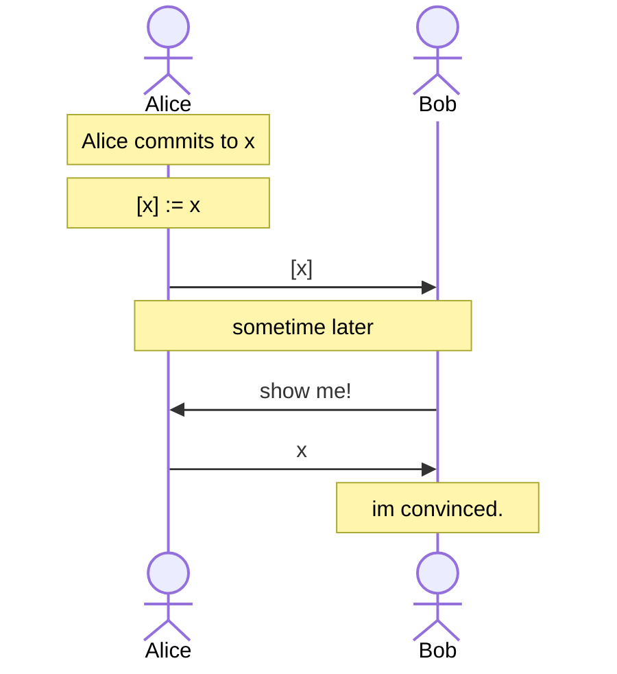

# Commitments

In a commitment scheme, Alice can commit to a value $x$ to obtain a commitment $\boxed{x}$. At some point later, Bob would like for Alice to reveal the committed value behind $\boxed{x}$, and show that indeed Alice was the one that had committed in the first place.

A rough informal sketch of this interaction can be shown as:

A cryptographic commitment scheme has two notable properties:

- **Hiding**: A commitment $\boxed{x}$ should reveal nothing about the underlying $x$.
- **Binding**: A commitment $\boxed{x}$, should only be revealed to $x$, i.e. for some $x' \ne x$ we shouldn't be able to compute a commitment $\boxed{x'} = \boxed{x}$.

TODO: more needed
